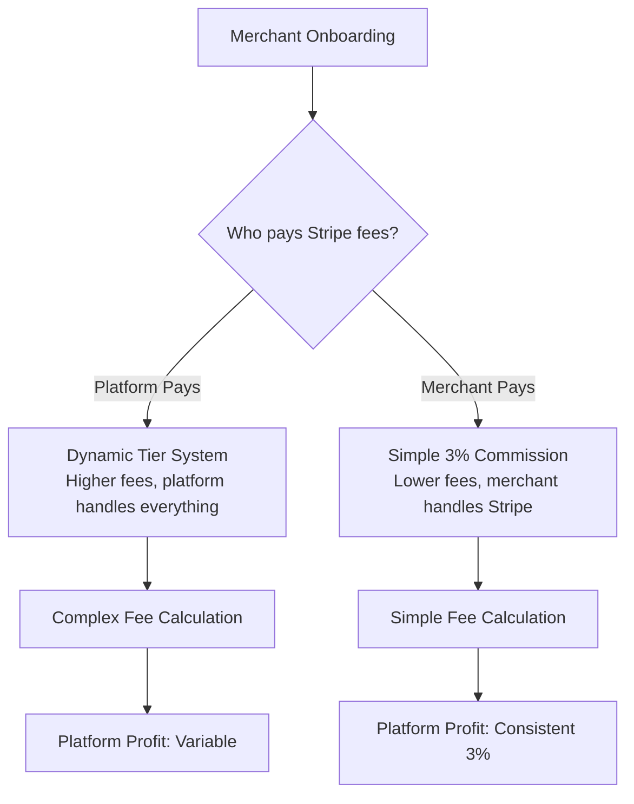

# Dual Business Model Fee System

## Overview

Your platform offers merchants **two flexible payment options** during onboarding:



---

## Model 1: Platform Pays Stripe Fees

### How It Works

- **Platform absorbs all Stripe costs** (2.9% + $0.30)
- **Uses dynamic 3-tier system** to ensure profitability
- **Higher fees** to cover Stripe and guarantee profit
- **Merchant sees one simple fee** - no complexity

### Fee Structure

| Tier | Order Range | Formula | Fee % | Platform Profit |
|------|-------------|---------|-------|-----------------|
| 1 | $1-$8.99 | $0.65 + 3.5% | 69%-8.3% | ~$0.34 |
| 2 | $9-$24.99 | $0.40 + 3.9% | 8.3%-5.9% | ~$0.14-$0.19 |
| 3 | $25+ | $0.05 + 4.0% | 4.8%-4.1% | ~$0.05 (min) |

### Example: $15 Order

```
Subtotal:        $15.00
Platform Fee:    $0.99  (6.6%)
Tax (13%):       $1.95
────────────────────────
Total Payment:   $17.94

BEHIND THE SCENES:
Stripe charges: $0.82
Our profit:     $0.17
```

### Pros for Merchant
- ✅ No Stripe account needed
- ✅ One simple fee to understand
- ✅ Platform handles all payment complexity
- ✅ No surprise Stripe costs

### Cons for Merchant
- ❌ Higher fees (6.6% vs 3% on $15 order)

---

## Model 2: Merchant Pays Stripe Fees

### How It Works

- **Merchant pays Stripe directly** (2.9% + $0.30)
- **Platform takes simple 3% commission** on subtotal
- **Lower platform fees** but merchant handles processing
- **Merchant needs Stripe Connect account**

### Fee Structure

**Simple:** `3% of subtotal`

No tiers. No complex math. Always 3%.

### Example: $15 Order

```
Subtotal:        $15.00
Platform Fee:    $0.45  (3%)
Tax (13%):       $1.95
────────────────────────
Total Payment:   $17.40

MERCHANT ALSO PAYS STRIPE:
Stripe fee on $17.40: ~$0.80
Merchant's net: $15 + $1.95 - $0.80 = $16.15

PLATFORM:
Our commission: $0.45 (full 3% is profit)
```

### Pros for Merchant
- ✅ Much lower platform fee (3% vs 6.6%)
- ✅ Transparent - knows exact commission
- ✅ Better for high-volume merchants

### Cons for Merchant
- ❌ Must set up Stripe Connect
- ❌ Pays Stripe fees separately
- ❌ Slightly more accounting complexity

---

## Profitability Comparison

### Platform Earnings by Order Size

| Order | Platform Pays Model | Merchant Pays Model | Winner |
|-------|---------------------|---------------------|--------|
| $5 | **$0.34** (16.6% fee) | $0.15 (3% fee) | Platform Pays |
| $10 | $0.14 (7.9% fee) | **$0.30** (3% fee) | Merchant Pays |
| $15 | $0.17 (6.6% fee) | **$0.45** (3% fee) | Merchant Pays |
| $20 | $0.19 (5.9% fee) | **$0.60** (3% fee) | Merchant Pays |
| $30 | $0.05 (4.6% fee) | **$0.90** (3% fee) | Merchant Pays |
| $50 | $0.05 (4.1% fee) | **$1.50** (3% fee) | Merchant Pays |

### Key Insight

🎯 **Merchant Pays model is MORE PROFITABLE** for the platform on orders over ~$7!

The flat 3% commission beats our tiered system profit margins on most typical food truck orders.

---

## Customer Impact

### What Customers See

**Platform Pays:**
- Subtotal: $15.00
- Service Fee: $0.99 ← Higher but simpler
- Tax: $1.95
- **Total: $17.94**

**Merchant Pays:**
- Subtotal: $15.00
- Service Fee: $0.45 ← Lower fee
- Tax: $1.95
- **Total: $17.40** ← $0.54 cheaper!

Customers save money when merchants choose "Merchant Pays" model.

---

## Merchant Decision Guide

### Choose "Platform Pays Stripe Fees" If:

- ✅ New to online payments
- ✅ Want simplicity and no tech setup
- ✅ Low volume (few orders per day)
- ✅ Don't want to manage Stripe account
- ✅ Prefer all-inclusive pricing

**Best for:** Small food trucks, first-time digital sellers, low-tech merchants

---

### Choose "Merchant Pays Stripe Fees" If:

- ✅ Already have Stripe account or comfortable with it
- ✅ Want lowest possible platform fees
- ✅ High volume (many orders per day)
- ✅ Understand payment processing
- ✅ Want transparent cost breakdown

**Best for:** Established food trucks, high-volume sellers, tech-savvy merchants

---

## Business Recommendation

### For the Platform

Based on the profitability analysis:

**Encourage "Merchant Pays Stripe Fees" model** because:
1. **Higher profit margins** ($0.45 vs $0.17 on $15 order)
2. **Simpler code** - no complex tier calculations
3. **Scales better** - 3% on $100 order = $3 profit vs $0.05 with tiered
4. **Competitive** - 3% is very fair
5. **Better for customers** - lower total fees

### Positioning

**During Onboarding:**

```
┌─────────────────────────────────────────────┐
│  Choose Your Payment Model                  │
├─────────────────────────────────────────────┤
│                                             │
│  🌟 RECOMMENDED: You Pay Stripe Fees        │
│     ├─ Just 3% platform commission          │
│     ├─ You save $0.54 per $15 order         │
│     ├─ Full control of payments             │
│     └─ Requires Stripe Connect              │
│                                             │
│  💼 SIMPLE: We Pay Stripe Fees              │
│     ├─ 4-7% platform fee (varies)           │
│     ├─ No Stripe setup needed               │
│     ├─ We handle everything                 │
│     └─ Best for beginners                   │
│                                             │
└─────────────────────────────────────────────┘
```

---

## Implementation Details

### Database Schema

Add to `merchant` table:

```prisma
model Merchant {
  id              String        @id @default(cuid())
  businessModel   BusinessModel @default(MERCHANT_PAYS_FEES)
  // ... other fields
}

enum BusinessModel {
  PLATFORM_PAYS_FEES
  MERCHANT_PAYS_FEES
}
```

### Fee Calculation in Code

```typescript
import { calculateFees, BusinessModel } from '@/lib/fee-calculator';

// Get merchant's business model from database
const merchant = await getMerchant(merchantId);

// Calculate fees based on their model
const breakdown = calculateFees(
  subtotal,
  taxRate,
  merchant.businessModel
);

// Use breakdown.platformFee in checkout
```

### Onboarding Flow

1. **Ask during merchant signup:**
   ```
   "Who should pay Stripe processing fees?"
   [ ] I'll pay them (Recommended - 3% commission)
   [ ] Platform pays them (Simple - 4-7% fee)
   ```

2. **If Merchant Pays:**
   - Set `businessModel = MERCHANT_PAYS_FEES`
   - Initiate Stripe Connect onboarding
   - Link Stripe account

3. **If Platform Pays:**
   - Set `businessModel = PLATFORM_PAYS_FEES`
   - No Stripe setup needed
   - Use platform's Stripe account

---

## Testing Both Models

Run comparison test:

```bash
npx tsx scripts/test-both-models.ts
```

This shows side-by-side comparison of both models across different order sizes.

---

## Migration Strategy

If you want to migrate existing merchants:

### Option 1: Keep Current Merchants on Platform Pays

- Set all existing: `PLATFORM_PAYS_FEES`
- New signups choose their model
- Allows merchants to switch later

### Option 2: Migrate Everyone to Merchant Pays

- Higher profit for platform
- Requires Stripe Connect setup for all
- Customers benefit from lower fees
- More technical work

### Recommended: Hybrid Approach

- Default new signups to `MERCHANT_PAYS_FEES` (recommended)
- Keep existing merchants on `PLATFORM_PAYS_FEES` 
- Allow merchants to switch models in dashboard
- Show potential savings to encourage switching

---

## Summary

| Aspect | Platform Pays | Merchant Pays |
|--------|---------------|---------------|
| **Platform Fee** | 4.1% - 69% (tiered) | Always 3% |
| **Platform Profit** | $0.05 - $0.34 | Consistent 3% of subtotal |
| **Customer Total** | Higher | Lower |
| **Merchant Setup** | None needed | Stripe Connect required |
| **Complexity** | Platform handles it | Merchant handles it |
| **Best For** | Beginners, low tech | Established, high volume |
| **Platform Profit on $15** | $0.17 | **$0.45** 💰 |
| **Recommendation** | Offer as option | **Push as default** ⭐ |

---

**Bottom Line:** The "Merchant Pays Stripe Fees" model is **MORE PROFITABLE** for your platform while also being **BETTER FOR CUSTOMERS**. Make it the recommended default! 🎯
